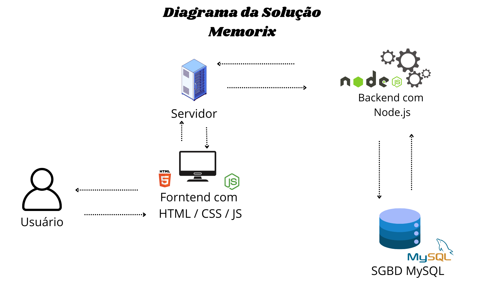
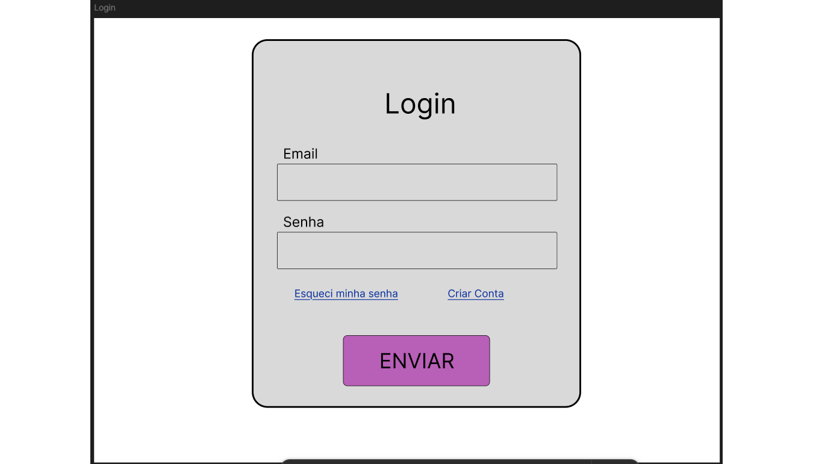
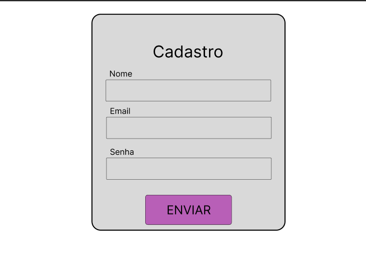
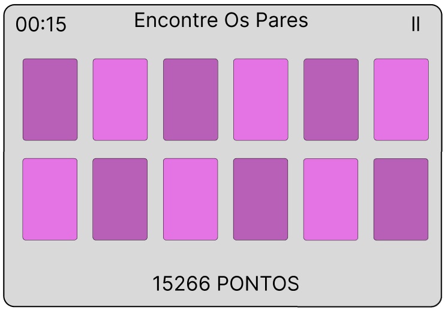
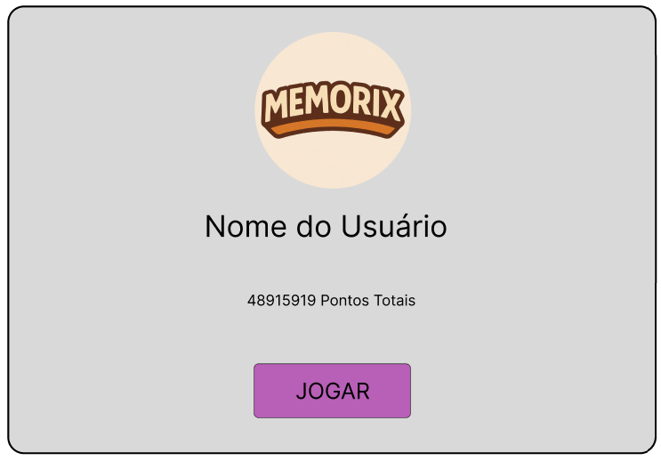
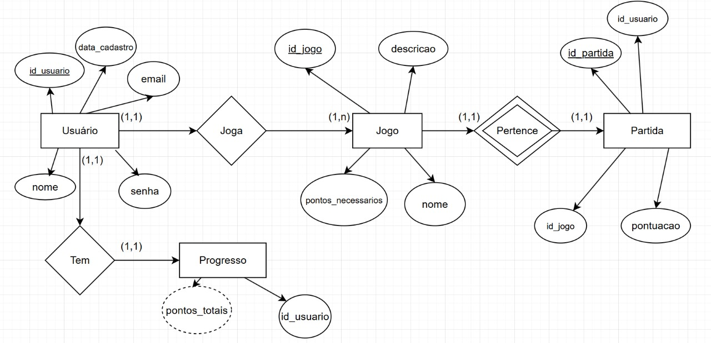
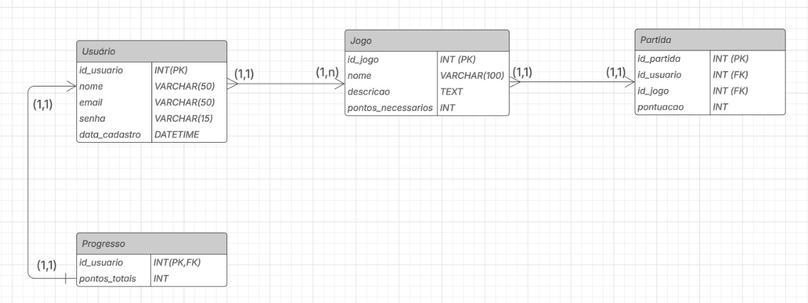
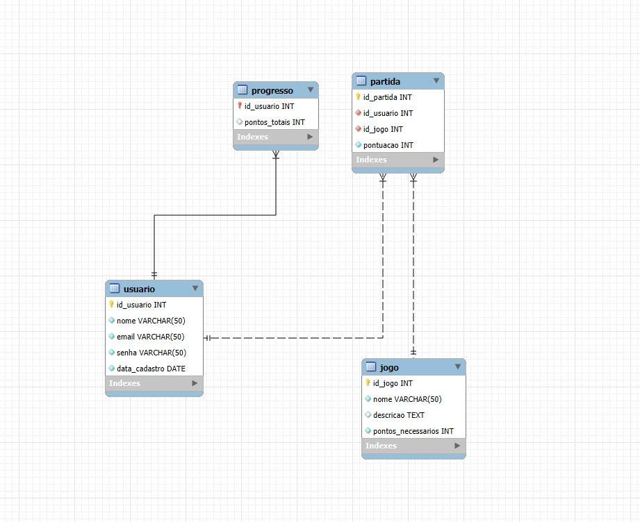

## 4. Projeto da Solução

Pré-requisitos: <a href="3-Especificação.md"> Especificação do Projeto (Requisitos do Software) </a>

## 4.1. Arquitetura da solução

 A interface será o ponto de contato entre o jogador e o jogo. É importante que a interface seja intuitiva, acessível e simples, com fontes grandes e botões claros. Deve permitir ações como clicar nas cartas, reiniciar o jogo, visualizar o tempo, etc.
 Tecnologias possíveis: HTML, CSS, JavaScript (com frameworks como React para interatividade).

 Utilizaremos tecnologias backend para gerenciar a lógica do jogo, controlar a destribuição das cartas, as combinações corretas e incorretas e os pontos.
 Tecnologias possíveis: JavaScript / Node.js.

 O armazenamento de dados pode ser necessário para salvar o progresso do jogador ou poder armazenar informações como pontuações, tempo de resposta, etc.
 Tecnologias possíveis: MySQL
 
 **Exemplo do diagrama de Arquitetura**:
 
 
 
 >FONTE: https://www.researchgate.net/figure/Figura-2-Diagrama-de-arquitectura-del-sistema_fig1_361400461 
 

### 4.2. Wireframes/Mockups de telas

Visão geral da interação do usuário pelas telas do sistema e protótipo interativo das telas com as funcionalidades que fazem parte do sistema (wireframes).
Apresente as principais interfaces da plataforma. Discuta como ela foi elaborada de forma a atender os requisitos funcionais, não funcionais e histórias de usuário abordados nas <a href="03-Especificação do Projeto.md"> Especificação do Projeto</a>.

Tela de Login, onde o usuário fará o acesso à sua conta:

Tela de Cadastro, onde o usuário criará as credencias de acesso para sua conta:

Tela de Memória, onde o usuário jogará o jogo da memória, que se adaptará de acordo com a dificuldade:

Tela Inicial, onde o usuário verá informações sobre sua pontuação total. (A tela será complementada posteriormente)

São protótipos usados em design de interface para sugerir a estrutura de um site web e seu relacionamentos entre suas páginas. Um wireframe web é uma ilustração semelhante do layout de elementos fundamentais na interface.
 
> **Links Úteis**:
> - [Protótipos vs Wireframes](https://www.nngroup.com/videos/prototypes-vs-wireframes-ux-projects/)
> - [Ferramentas de Wireframes](https://rockcontent.com/blog/wireframes/)
> - [MarvelApp](https://marvelapp.com/developers/documentation/tutorials/)
> - [Figma](https://www.figma.com/)
> - [Adobe XD](https://www.adobe.com/br/products/xd.html#scroll)
> - [Axure](https://www.axure.com/edu) (Licença Educacional)
> - [InvisionApp](https://www.invisionapp.com/) (Licença Educacional)

## Modelo ER

O Modelo ER representa através de um diagrama como as entidades (coisas, objetos) se relacionam entre si na aplicação interativa.]

As referências abaixo irão auxiliá-lo na geração do artefato “Modelo ER”.

> - [Como fazer um diagrama entidade relacionamento | Lucidchart](https://www.lucidchart.com/pages/pt/como-fazer-um-diagrama-entidade-relacionamento)

### 4.3. Modelo de dados

O desenvolvimento da solução proposta requer a existência de bases de dados que permitam efetuar os cadastros de dados e controles associados aos processos identificados, assim como recuperações.
Utilizando a notação do DER (Diagrama Entidade e Relacionamento), elaborem um modelo, na ferramenta visual indicada na disciplina, que contemple todas as entidades e atributos associados às atividades dos processos identificados. Deve ser gerado um único DER que suporte todos os processos escolhidos, visando, assim, uma base de dados integrada. O modelo deve contemplar, também, o controle de acesso de usuários (partes interessadas dos processos) de acordo com os papéis definidos nos modelos do processo de negócio.
_Apresente o modelo de dados por meio de um modelo relacional que contemple todos os conceitos e atributos apresentados na modelagem dos processos._

#### 4.3.1 Modelo ER

O Modelo ER representa através de um diagrama como as entidades (coisas, objetos) se relacionam entre si na aplicação interativa.]

As referências abaixo irão auxiliá-lo na geração do artefato “Modelo ER”.

> - [Como fazer um diagrama entidade relacionamento | Lucidchart](https://www.lucidchart.com/pages/pt/como-fazer-um-diagrama-entidade-relacionamento)

#### 4.3.2 Esquema Relacional
**OBS:** Se o aluno utilizar BD NoSQL, ele não precisará fazer essa parte, mas caso haja interesse basta perguntar a prof de BD NoSQL. 

O Esquema Relacional corresponde à representação dos dados em tabelas juntamente com as restrições de integridade e chave primária.
 
As referências abaixo irão auxiliá-lo na geração do artefato “Esquema Relacional”.

> - [Criando um modelo relacional - Documentação da IBM](https://www.ibm.com/docs/pt-br/cognos-analytics/10.2.2?topic=designer-creating-relational-model)

---
Esquema Relacional gerado pelo MySQL:

#### 4.3.3 Modelo Físico

Insira aqui o script de criação das tabelas do banco de dados. 
**OBS:** Se o aluno utilizar BD NoSQL, ele derá incluir o script aqui também. 

Veja um exemplo:

<code>

create database memiorix; 
use memorix; 

 -- Criação da tabela Usuário
CREATE TABLE Usuario (
    id_usuario INT PRIMARY KEY AUTO_INCREMENT,
    nome VARCHAR(50) NOT NULL,
    email VARCHAR(50) NOT NULL UNIQUE,
    senha VARCHAR(50) NOT NULL,
    data_cadastro DATE NOT NULL
);

-- Criação da tabela Jogo
CREATE TABLE jogo (
    id_jogo INT PRIMARY KEY AUTO_INCREMENT,
    nome VARCHAR(50) NOT NULL,
    descricao TEXT,
    pontos_necessarios INT NOT NULL
);

-- Criação da tabela Partida
CREATE TABLE partida (
    id_partida INT PRIMARY KEY AUTO_INCREMENT,
    id_usuario INT NOT NULL,
    id_jogo INT NOT NULL,
    pontuacao INT NOT NULL,
    FOREIGN KEY (id_usuario) REFERENCES Usuario(id_usuario),
    FOREIGN KEY (id_jogo) REFERENCES Jogo(id_jogo)
);

-- Criação da tabela Progresso
CREATE TABLE progresso (
    id_usuario INT PRIMARY KEY,
    pontos_totais INT,
    FOREIGN KEY (id_usuario) REFERENCES Usuario(id_usuario)
);

</code>

**Este script deverá ser incluído em um arquivo .sql na pasta src\bd.**

### 4.4. Tecnologias

_Descreva qual(is) tecnologias você vai usar para resolver o seu problema, ou seja, implementar a sua solução. Liste todas as tecnologias envolvidas, linguagens a serem utilizadas, serviços web, frameworks, bibliotecas, IDEs de desenvolvimento, e ferramentas._

Apresente também uma figura explicando como as tecnologias estão relacionadas ou como uma interação do usuário com o sistema vai ser conduzida, por onde ela passa até retornar uma resposta ao usuário.

| **Dimensão**   | **Tecnologia**  |
| ---            | ---             |
| SGBD           | MySQL           |
| Front end      | HTML+CSS+JS     |
| Back end       | Java SpringBoot |
| Deploy         | Github Pages    |

